

# SE-Assignment-6
 Assignment: Introduction to Python
Instructions:
Answer the following questions based on your understanding of Python programming. Provide detailed explanations and examples where appropriate.

 Questions:

1. Python Basics:
   - What is Python, and what are some of its key features that make it popular among developers? Provide examples of use cases where Python is particularly effective.
Python is a high-level, interpreted programming language known for its readability, simplicity, and versatility. It was created by Guido van Rossum and first released in 1991. Python emphasizes code readability and allows developers to write concise and clear code for both small and large-scale projects.
Key Features of Python
Readability and Simplicity - Python's syntax is designed to be intuitive and its code is readable, which makes it an excellent language for beginners.
Interpreted Language - Python is executed line by line, which makes debugging easier and speeds up development.
Dynamically Typed - Variables in Python do not need explicit declaration to reserve memory space. The interpreter allocates memory dynamically at runtime.
Extensive Standard Library - Python comes with a large standard library that includes modules and packages for various tasks, such as web development, data analysis, machine learning, and more.
Cross-Platform Compatibility - Python can run on various operating systems, including Windows, macOS, and Linux, without requiring any modifications to the code.
Large Community and Ecosystem - Python has a large and active community that contributes to its vast ecosystem of third-party libraries and frameworks.
Integration Capabilities - Python can easily integrate with other languages and technologies, such as C, C++, and Java, through various interfaces.
Cases Where Python is Particularly Effective
Web Development - Frameworks like Django, Flask, and Pyramid make it easy to develop robust web applications quickly. Django is used by companies like Instagram and Pinterest for their web platforms.
Data Science and Analytics - Libraries such as Pandas, NumPy, and Matplotlib make Python a powerful tool for data manipulation, analysis, and visualization. Data analysts use Pandas to clean and analyze large datasets efficiently.
Machine Learning and AI - Python has become the go-to language for machine learning and AI, thanks to libraries like TensorFlow, Keras, and Scikit-learn. Google’s TensorFlow is widely used for building deep learning models.
Automation and Scripting - Python is commonly used for writing scripts to automate repetitive tasks and system administration. System administrators use Python scripts to automate server management and deployment.
Scientific Computing - Libraries like SciPy and SymPy are used for scientific and mathematical computations. Researchers use SciPy for tasks involving linear algebra, integration, and optimization.
Game Development - Libraries such as Pygame allow for the creation of simple games and multimedia applications. Indie developers use Pygame to create 2D games and prototypes.
Networking - Python provides libraries like Twisted and socket for building network applications. Developers use Twisted to create scalable and reliable network servers and clients.

2. Installing Python:
   - Describe the steps to install Python on your operating system (Windows, macOS, or Linux). Include how to verify the installation and set up a virtual environment.
   Installing Python on Windows
Download Python Installer:
Go to the official Python website.
Click on the "Downloads" section and select "Download Python" for Windows.
Run the Installer:
Open the downloaded .exe file.
Check the box that says "Add Python to PATH".
Click on "Install Now" or choose "Customize installation" if you want to select specific features or install location.
Verify Installation:
Open Command Prompt.
Type python --version or python -V and press Enter. You should see the Python version number.
Installing Python on macOS
Download Python Installer:
Go to the official Python website.
Click on the "Downloads" section and select "Download Python" for macOS.
Run the Installer:
Open the downloaded .pkg file.
Follow the instructions in the installer.
Verify Installation:
Open Terminal.
Type python3 --version and press Enter. You should see the Python version number.
Installing Python on Linux
Update Package Lists:
Open Terminal.
Run sudo apt update (for Debian-based systems like Ubuntu) or sudo yum update (for Red Hat-based systems like Fedora).
Install Python:
Run sudo apt install python3 (for Debian-based systems) or sudo yum install python3 (for Red Hat-based systems).
Verify Installation:
Open Terminal.
Type python3 --version and press Enter. You should see the Python version number.
Setting Up a Virtual Environment
Install venv module (if not already installed):
Run pip install virtualenv.
Create a Virtual Environment:
Navigate to your project directory in the terminal.
Run python3 -m venv myenv (replace myenv with the name you want for your virtual environment).
Activate the Virtual Environment:
On Windows: myenv\Scripts\activate.
On macOS and Linux: source myenv/bin/activate.
Deactivate the Virtual Environment:
Simply run deactivate in the terminal.
Verify Virtual Environment:
When activated, your terminal prompt should change to show the name of your virtual environment.
You can also run which python (macOS/Linux) or where python (Windows) to verify that you're using the Python interpreter from your virtual environment.

3. Python Syntax and Semantics:
   - Write a simple Python program that prints "Hello, World!" to the console. Explain the basic syntax elements used in the program.

   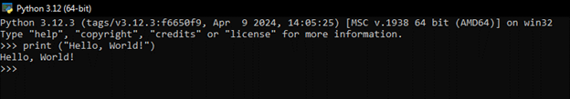
Explanation of Basic Syntax Elements
print function
The print function is a built-in function in Python used to output text or other information to the console.
It takes one or more arguments, which can be strings, numbers, or other data types, and prints them to the console.
Parentheses ()
The parentheses () are used to enclose the arguments of a function. In this case, "Hello, World!" is the argument passed to the print function.
Quotation Marks ""
The double quotation marks "" (or single quotation marks '') are used to define a string literal in Python. A string is a sequence of characters enclosed in quotes.
"Hello, World!" is a string literal representing the text we want to print.
Running the Program
To run this program, follow these steps:
Save the Program
Save the code in a file with a .py extension, for example, hello.py.
Run the Program
Open a terminal or command prompt.
Navigate to the directory where the hello.py file is saved.
Run the program by typing python hello.py or python3 hello.py and pressing Enter.

4. Data Types and Variables:
   - List and describe the basic data types in Python. Write a short script that demonstrates how to create and use variables of different data types.
Basic Data Types in Python
Integer (int)
Represents whole numbers, positive or negative, without a fractional part.
Example: 42, -7
Float (float)
Represents real numbers, positive or negative, with a fractional part.
Example: 3.14, -0.001
String (str)
Represents sequences of characters enclosed in single or double quotes.
Example: "hello", 'world'
Boolean (bool)
Represents one of two values: True or False.
Example: True, False
List (list)
Represents ordered collections of items, which can be of any data type, enclosed in square brackets.
Example: [1, 2, 3], ["apple", "banana", "cherry"]
Tuple (tuple)
Represents ordered, immutable collections of items, which can be of any data type, enclosed in parentheses.
Example: (1, 2, 3), ("apple", "banana", "cherry")
Dictionary (dict)
Represents collections of key-value pairs, enclosed in curly braces.
Example: {"name": "Alice", "age": 30}, {"key1": "value1", "key2": "value2"}
Set (set)
Represents unordered collections of unique items, enclosed in curly braces.
Example: {1, 2, 3}, {"apple", "banana", "cherry"}
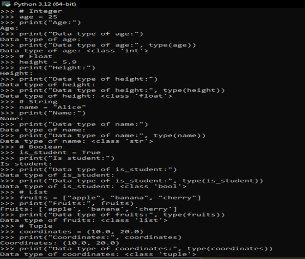
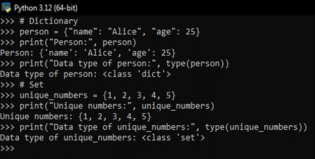 
Explanation of the Script
Integer - The variable age is assigned an integer value of 25. The type function confirms the data type.
Float - The variable height is assigned a floating-point number 5.9. The type function confirms the data type.
String - The variable name is assigned a string value "Alice". The type function confirms the data type.
Boolean - The variable is_student is assigned a boolean value True. The type function confirms the data type.
List - The variable fruits is assigned a list of strings. The type function confirms the data type.
Tuple - The variable coordinates is assigned a tuple with two floating-point numbers. The type function confirms the data type.
Dictionary - The variable person is assigned a dictionary with key-value pairs. The type function confirms the data type.
Set - The variable unique_numbers is assigned a set of integers. The type function confirms the data type.

5. Control Structures:
   - Explain the use of conditional statements and loops in Python. Provide examples of an `if-else` statement and a `for` loop.
Conditional statements allow you to execute certain pieces of code based on conditions being true or false. The main conditional statements in Python are if, else, and elif (short for "else if"). 
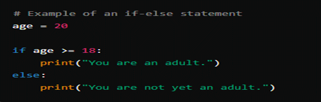 
Explanation:
In this example, the variable age is assigned the value 20.
The if statement checks if age is greater than or equal to 18.
If the condition (age >= 18) evaluates to True, it prints "You are an adult.".
If the condition evaluates to False, the else block executes and prints "You are not yet an adult.".
Loops in Python
Loops in Python allow you to execute a block of code repeatedly until a certain condition is met. The two main types of loops in Python are for loops and while loops.
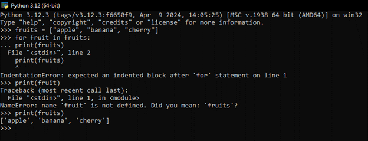 
Explanation:
In this example, fruits is a list containing three strings: "apple", "banana", and "cherry".
The for loop iterates over each element (fruit) in the fruits list.
During each iteration, the current fruit is printed using the print statement.
How it works:
The for loop iterates over each element in the fruits list.
In the first iteration, fruit takes the value "apple", then "banana" in the second iteration, and finally "cherry" in the third iteration.
Each value of fruit is printed to the console.

6. Functions in Python:
   - What are functions in Python, and why are they useful? Write a Python function that takes two arguments and returns their sum. Include an example of how to call this function.
Functions in Python are blocks of organized, reusable code that perform a specific task. They allow you to break down your code into smaller, manageable pieces, which can be called multiple times from different parts of your program. Functions help in improving code readability, reusability, and modularity.
Characteristics of Functions:
Modularity: Functions encapsulate code into logical units, making it easier to manage and maintain.
Reusability: Functions can be called multiple times from different parts of the program, reducing redundancy.
Abstraction: Functions hide the implementation details, allowing you to focus on what the function does rather than how it does it.
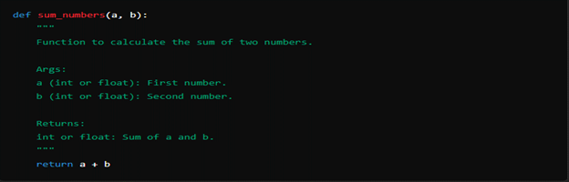 
Explanation:
sum_numbers is the name of the function.
a and b are parameters (input variables) that the function expects to receive when called.
The function calculates the sum of a and b using the + operator.
The return statement sends back the result of the calculation to the caller.
Calling the Function
To use or call the sum_numbers function:
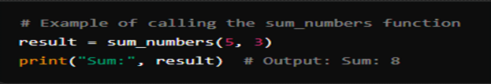 
Explanation:
sum_numbers(5, 3) calls the sum_numbers function with arguments 5 and 3.
The function computes 5 + 3 and returns 8.
The returned value 8 is assigned to the variable result.
Finally, print("Sum:", result) prints the result "Sum: 8" to the console.
Functions are useful for several reasons:
Code Reusability: Write code once and reuse it multiple times.
Modularity: Break down complex tasks into smaller, manageable parts.
Readability: Functions provide a clear structure and improve the readability of your code.
Testing and Debugging: Functions make it easier to test and debug specific parts of your program.

7. Lists and Dictionaries:
   - Describe the differences between lists and dictionaries in Python. Write a script that creates a list of numbers and a dictionary with some key-value pairs, then demonstrates basic operations on both.
   Lists (list):
Ordered Collection: Lists are ordered collections of items. The order in which you add items to a list is maintained.
Indexing: Elements in a list are accessed by their position (index), which starts at 0.
Mutable: Lists can be modified after creation. You can add, remove, or change elements in a list.
Syntax: Lists are defined using square brackets [].
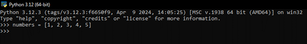 
Dictionaries (dict):
Unordered Collection: Dictionaries are unordered collections of key-value pairs. The order of items is not guaranteed.
Key-Based Access: Elements in a dictionary are accessed by their keys, which can be of any immutable type (strings, numbers, tuples).
Mutable: Dictionaries can be modified after creation. You can add, remove, or change key-value pairs.
Syntax: Dictionaries are defined using curly braces {} with key: value pairs separated by commas.
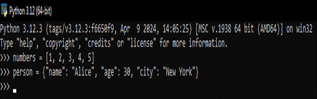 
Script Demonstrating Basic Operations
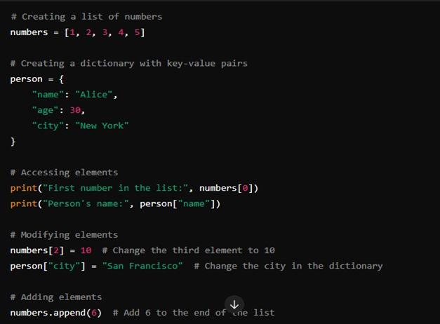 
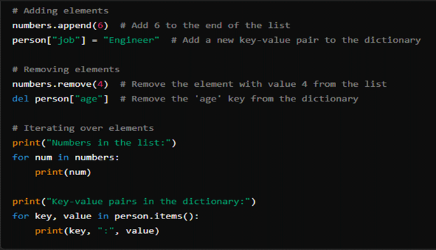 
Explanation of Operations:
Accessing Elements: Use indexing (numbers[0]) for lists and keys (person["name"]) for dictionaries to access specific elements.
Modifying Elements: Modify elements by assigning new values (numbers[2] = 10) or updating key-value pairs (person["city"] = "San Francisco").
Adding Elements: Use append() for lists (numbers.append(6)) and directly assign new key-value pairs for dictionaries (person["job"] = "Engineer").
Removing Elements: Remove elements from lists using remove() or del statement (del person["age"]) for dictionaries.
Iterating Over Elements: Use for loops to iterate over elements in both lists and dictionaries using for num in numbers: and for key, value in person.items(): respectively.

8. Exception Handling:
   - What is exception handling in Python? Provide an example of how to use `try`, `except`, and `finally` blocks to handle errors in a Python script.
Exception handling in Python allows you to gracefully manage and respond to errors or exceptions that occur during program execution. Errors in Python are represented as exceptions, and you can use try, except, and optionally finally blocks to handle these exceptions.
Components of Exception Handling:
try block: Contains the code that may raise an exception.
except block: Specifies what to do if a specific exception is raised within the try block.
finally block (optional): Executes cleanup code, whether an exception occurred or not.
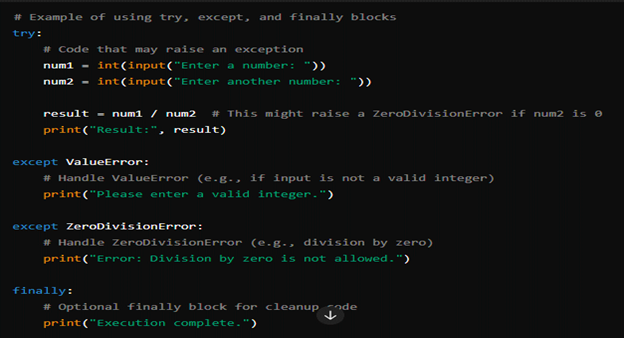 
Explanation:
In the try block, the user is prompted to enter two numbers (num1 and num2).
The division operation result = num1 / num2 may raise a ZeroDivisionError if num2 is 0.
The except block catches specific exceptions (ValueError and ZeroDivisionError) and handles them appropriately:
If a ValueError occurs (e.g., if the user inputs a non-integer), it prints a message asking for a valid integer.
If a ZeroDivisionError occurs (e.g., if num2 is 0), it prints a message stating that division by zero is not allowed.
The finally block is executed regardless of whether an exception occurred or not. It prints "Execution complete." This block is typically used for cleanup actions, such as closing files or releasing resources.
When to Use Exception Handling
Exception handling is useful in scenarios where there is anticipation of possible errors or exceptions that may occur during program execution, such as:
User input validation.
File operations (e.g., reading or writing files).
Network operations (e.g., handling connection errors).
Mathematical operations (e.g., division by zero).
By using exception handling, you can ensure that your program can recover gracefully from errors, provide meaningful error messages to users, and perform necessary cleanup actions.

9. Modules and Packages:
   - Explain the concepts of modules and packages in Python. How can you import and use a module in your script? Provide an example using the `math` module.
Modules:
Modules in Python are files containing Python code, typically containing functions, classes, and variables.
They allow to organize code into separate files to make it more manageable and reusable.
You can import modules into other Python scripts to access their functionality.
Packages:
Packages are namespaces that contain multiple modules.
They are directories containing Python modules and an __init__.py file (which may be empty).
Packages help in organizing and structuring large Python projects into hierarchical directories.
Importing and Using a Module in Python
To import and use a module in Python, you use the import statement followed by the name of the module:
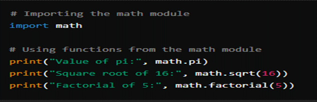 
Explanation:
import math: Imports the entire math module, allowing you to access all functions and constants defined in it.
math.pi: Accesses the constant pi defined in the math module and prints its value.
math.sqrt(16): Calls the sqrt() function from the math module to calculate the square root of 16.
math.factorial(5): Calls the factorial() function from the math module to calculate the factorial of 5.
Importing Specific Functions or Constants from a Module
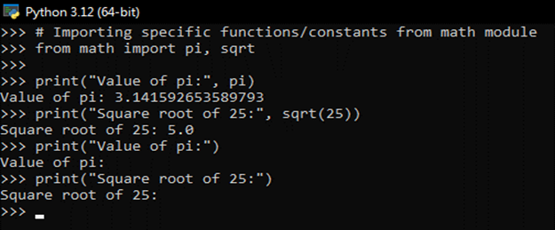 
Explanation:
from math import pi, sqrt: Imports only the pi constant and the sqrt function from the math module.
This approach allows you to use these specific functions/constants directly without specifying math. before them.
Renaming Imported Modules or Functions
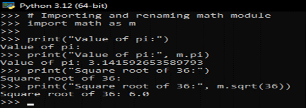
Explanation:
import math as m: Imports the math module and renames it to m.
You can now access math functions and constants using m. instead of math..

10. File I/O:
    - How do you read from and write to files in Python? Write a script that reads the content of a file and prints it to the console, and another script that writes a list of strings to a file.
Python provides built-in functions and methods to read from and write to files. It can perform these operations using file objects that are created using the open() function.
Reading from a File
Open the File: Use the open() function to open a file in read mode ('r').
Read the Content: Use methods like read(), readline(), or readlines() to read the content of the file.
Close the File: Close the file using the close() method to free up system resources.
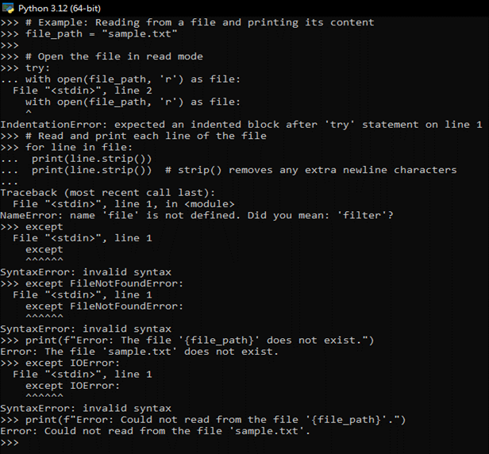 
Explanation:
open(file_path, 'r'): Opens the file named "sample.txt" in read mode ('r').
with open(...) as file: Uses a context manager (with statement) to automatically close the file after reading.
for line in file: Iterates over each line in the file.
print(line.strip()): Strips any trailing newline characters (\n) and prints each line.
Writing to a File
Open the File: Use the open () function to open a file in write mode ('w').
Write Content: Use methods like write () to write data to the file.

# Submission Guidelines:
- Your answers should be well-structured, concise, and to the point.
- Provide code snippets or complete scripts where applicable.
- Cite any references or sources you use in your answers.
- Submit your completed assignment by [due date].

